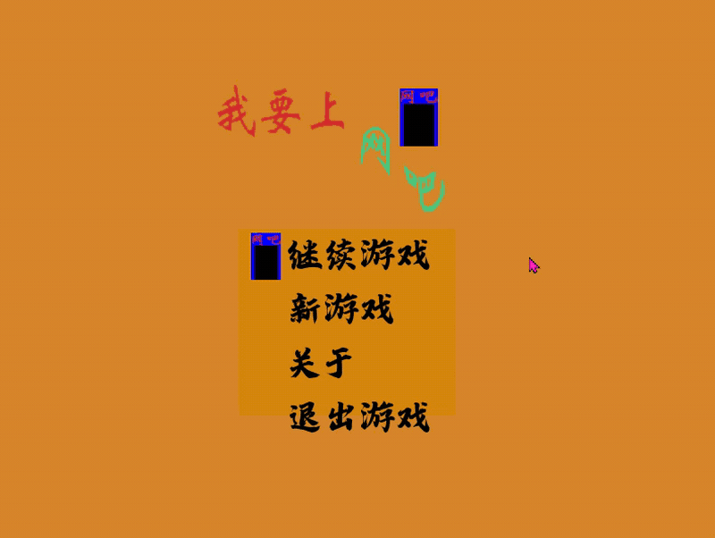

# 我要上网吧 (Let Me Surf The Net)

<div align="center">


**一个基于 Pygame 开发的 2D 平台跳跃游戏**

[功能特性](#功能特性) • [技术架构](#技术架构) • [快速开始](#快速开始) • [操作说明](#操作说明)

</div>

---

## 📖 项目简介

**"我要上网吧"** 是一款使用 Python 和 Pygame 引擎开发的 2D 平台跳跃类游戏。玩家需要操控角色在各种精心设计的关卡中躲避陷阱、跨越障碍，最终到达终点门完成关卡。

### 🎬 游戏演示



### 核心玩法

- **平台跳跃**: 经典的横版跳跃玩法，支持多段跳跃和重力模拟
- **陷阱系统**: 多种动态陷阱，包括齿轮、地刺、尖刺和移动墙壁
- **关卡系统**: 支持多关卡进度保存，关卡数据采用 JSON 配置化设计
- **状态管理**: 完整的游戏状态机（主菜单、加载界面、游戏关卡、暂停界面）

---

## ✨ 功能特性

### 游戏系统

| 系统 | 描述 |
|------|------|
| 🎮 玩家控制系统 | 支持左右移动、跳跃、多状态切换（站立/奔跑/跳跃/坠落） |
| 🗺️ 关卡系统 | 5个预设关卡，支持进度保存与恢复 |
| 🪤 陷阱系统 | 4类陷阱：齿轮陷阱、地刺陷阱、尖刺陷阱、移动墙壁陷阱 |
| 💾 存档系统 | 自动保存关卡进度、死亡次数、游戏时长 |
| ⏸️ 暂停系统 | 支持游戏中暂停、返回主菜单、关卡切换 |
| 🎨 精灵动画 | 基于精灵表的角色和陷阱动画系统 |

### 技术特性

- **状态机架构**: 清晰的游戏状态管理（MainMenu → LoadScreen → Level → PauseScreen）
- **数据驱动**: 关卡地图、陷阱配置、玩家属性均采用 JSON 外部配置
- **碰撞检测**: 基于 Pygame Sprite 组的精确像素碰撞检测
- **模块化设计**: 组件、状态、数据三层分离，易于扩展

---

## 🏗️ 技术架构

### 技术栈

| 类别 | 技术 |
|------|------|
| 编程语言 | Python 3.x |
| 游戏引擎 | Pygame |
| 数据格式 | JSON |
| 资源管理 | 精灵表 (Sprite Sheet) |

### 项目结构

```
我要上网吧/
├── main.py                          # 游戏入口
├── source/
│   ├── run_.py                     # 游戏主控制器（主循环、状态切换）
│   ├── setup.py                    # 游戏初始化（Pygame、资源加载）
│   ├── constans.py                 # 全局常量定义
│   ├── tools.py                    # 工具函数（图片加载、JSON操作）
│   ├── track.py                    # 陷阱触发检测系统
│   ├── sound.py                    # 音频管理（预留）
│   ├── components/                 # 游戏组件
│   │   ├── player.py              # 玩家角色类
│   │   ├── trap.py                # 陷阱类（齿轮/地刺/尖刺/墙壁）
│   │   ├── door.py                # 终点门类
│   │   └── info.py                # 文字信息显示类
│   ├── states/                     # 游戏状态
│   │   ├── main_menu.py           # 主菜单状态
│   │   ├── load_screen.py         # 关卡加载界面
│   │   ├── level.py               # 游戏关卡状态
│   │   └── pause_screen.py        # 暂停界面状态
│   └── data/                      # 游戏数据
│       ├── maps/
│       │   ├── map.json           # 关卡地图数据
│       │   ├── trap.json          # 陷阱配置数据
│       │   └── memory.json        # 游戏进度存档
│       └── player/
│           └── GZJ.json           # 玩家精灵帧数据
└── resources/
    ├── graphics/                   # 图片资源
    ├── font/                       # 字体资源
    ├── music/                      # 背景音乐（预留）
    └── sound/                      # 音效（预留）
```

### 核心类图

```
Game (run_.py)
├── MainMenu (main_menu.py)         # 主菜单状态
├── LoadScreen (load_screen.py)     # 关卡加载状态
├── Level (level.py)                # 游戏关卡状态
│   ├── Player (player.py)          # 玩家实体
│   ├── Door (door.py)              # 终点门实体
│   ├── Trap Classes (trap.py)      # 各类陷阱实体
│   └── Track (track.py)            # 陷阱触发检测
└── Pause_screen (pause_screen.py)  # 暂停状态
```

---

## 🚀 快速开始

### 环境要求

- Python 3.7+
- Pygame 2.0+

### 安装依赖

```bash
pip install pygame
```

### 运行游戏

```bash
# 克隆项目
git clone <repository-url>
cd 我要上网吧

# 运行游戏
python main.py
```

---

## 🎮 操作说明

### 主菜单

| 按键 | 功能 |
|------|------|
| `W` / `S` | 上下切换菜单选项 |
| `Enter` | 确认选择 |

### 游戏中

| 按键 | 功能 |
|------|------|
| `A` / `D` | 左右移动 |
| `Space` | 跳跃（支持可变跳跃高度） |
| `ESC` | 暂停/继续游戏 |
| `←` (左箭头) | 死亡重开关卡 |
| `↑` (上箭头) | 返回上一关 |
| `↓` (下箭头) | 跳到下一关 |

### 暂停界面

| 操作 | 功能 |
|------|------|
| 鼠标点击"返回主界面" | 返回主菜单 |
| 鼠标点击"上一关" | 重新挑战前一关 |
| 鼠标点击"下一关" | 跳到下一关 |

---

## 🗺️ 关卡数据格式

### 地图数据 (map.json)

地图使用二维数组表示，数值含义：

| 值 | 含义 |
|----|------|
| `1` | 地面/墙壁 |
| `0` | 空白区域 |
| `10` | 玩家起始位置 |
| `100` | 终点门位置 |

示例：
```json
{
  "level_001": {
    "number": 1,
    "map": [[1,1,1,...], ...],
    "buff": {
      "measure": 0.5,    // 玩家缩放比例
      "x_vel": 5,        // 水平移动速度
      "y_vel": 20,       // 跳跃初速度
      "gravity": 3,      // 重力系数
      "tall": 25         // 跳跃高度
    }
  }
}
```

### 陷阱数据 (trap.json)

```json
{
  "level_001": {
    "gear_trap": {        // 齿轮陷阱
      "1": {
        "trap_xy": [x, y, resize],
        "trap_track": [trigger_x, trigger_y]
      }
    }
  }
}
```

---

## 🔧 开发笔记

### 已知问题与解决方案

本项目开发过程中记录的技术问题与解决方案：

1. **抽象类实例化问题**: Python ABC 中 `@abstractmethod` 优先级高于实现体，有此装饰器子类必须覆写
2. **文件路径问题**: 写文件前需创建父目录 `os.makedirs(os.path.dirname(path), exist_ok=True)`
3. **游戏循环优化**: 使用 Pygame 时钟控制帧率为 60FPS
4. **碰撞检测优化**: 使用 `pygame.sprite.spritecollideany()` 进行高效的精灵碰撞检测

---

## 📝 开发日志

| 日期 | 完成内容 |
|------|----------|
| 9.9 | 完成墙壁与玩家的碰撞检测 |
| 9.10 | 完成关卡切换与重试功能 |
| 9.11 | 完成游戏暂停与关卡记忆功能 |
| 9.15 | 完成陷阱触发条件系统 |
| 9.18 | 完成死亡与复活机制 |
| 9.25 | 完成移动墙壁陷阱 |
| 9.28 | 完成单体动态效果与代码优化 |

---

## 📄 许可证

本项目为个人学习项目，仅供学习交流使用。

---

## 🙏 致谢

- Pygame 社区提供的优秀游戏开发框架
- 精灵素材设计

---

<div align="center">

**如果这个项目对你有帮助，欢迎点亮 ⭐ Star！**

</div>
